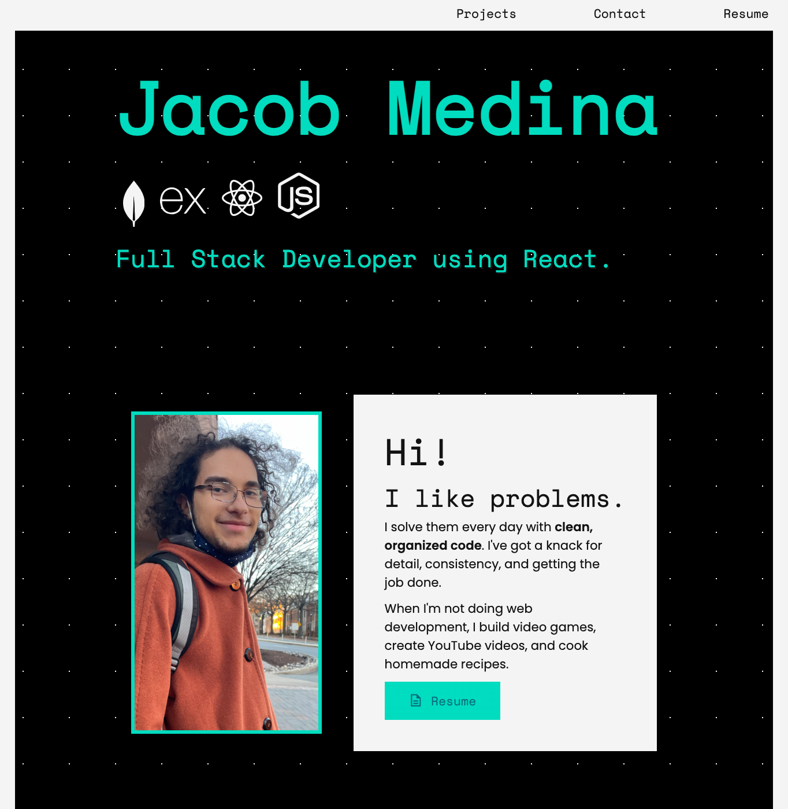

# Jacob Medina Portfolio

## Description

[Click here to visit the live website.](https://jacob-medina.github.io/portfolio/)

This project is my professional portfolio, which outlines my web development projects and some information about myself.

The aim of my portfolio is to present my skills and works to potential employers. When viewing the website, employers will see a clean and responsive user interface. This adds more credibility and professionalism to my work.

## Usage

My portfolio is fully interactive and responsive. Users may do the following:
- Resize the window to get a layout that is appropriate for the screen dimensions

- Navigation Menu
  - Click on the **Projects** or **Contact** link to scroll to those respective sections
  - Click on the **Resume** link to open a PDF of my resume

- Projects
  - Click on a **Live Site** button or project image to open the live website of that particular project
  - Click on a **See Code** button to open the respository of the project

- Contact
  - Click on the **Email** anchor to open a `mailto` link with me as the recipient
  - Click on the **LinkedIn** or **GitHub** anchors to open my account on those respective sites

## Credits

All images in the folder `/logos` originate from [World Vector Logo](https://worldvectorlogo.com/).

The file `reset.css` was not created by me. It was downloaded from [meyerweb](https://meyerweb.com), which provides a public reset.css file. It comes with the following citation information:

> http://meyerweb.com/eric/tools/css/reset/ 
> 
> v2.0 | 20110126
>
>License: none (public domain)

The fonts used in my portfolio are not owned by me, but are open-source. Here is the copyright for the fonts:
> Copyright 2020 The Poppins Project Authors [https://github.com/itfoundry/Poppins](https://github.com/itfoundry/Poppins)
>
> Copyright 2020 The Space Grotesk Project Authors [https://github.com/floriankarsten/space-grotesk](https://github.com/floriankarsten/space-grotesk)
>
> All fonts are held under the [SIL Open Font License, 1.1](http://scripts.sil.org/cms/scripts/page.php?site_id=nrsi&id=OFL)

## License

This project is made under the [MIT License](./LICENSE).
